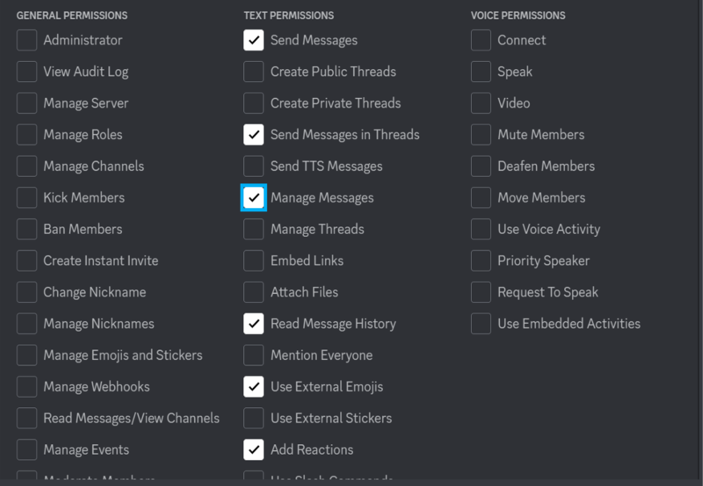

# Spotbot 2
A discord bot that scrapes users spotify links from a set channel and automatically adds those songs to a set spotify playlist. Think of it like an *over* engineered collaborative playlist.


## Table of Contents
- [Requirements](#requirements)
- [Install](#install)
- [Contributing](#contributing)
- [License](#license)


## Requirements
[](https://www.python.org/) 


## Install
1. Create a spotify App:

    a. Go to https://developer.spotify.com/dashboard/ and Login

    c. Create an App
    
    d. Copy and paste the client id and client secret from the Spotify app. These will be placed in their respective places in `setup.json`
    
    e. select Edit Settings and add the following Redirect URIs

```
http://localhost:5000/callback
http://localhost:5000/redirect
http://localhost:5000/redirect/
http://127.0.0.1:5000/redirect
http://127.0.0.1:5000/redirect/
```
    
 2. Create a Discord Bot
    
    a. On https://discord.com/developers/ go to Applications > New Applications
    
    b. Next, the Bot tab > Create Bot 
    
    c. Retrieve the token (may need to reset it), copy it, and paste that token in its respective place in `setup.json`
    
    d. Enable the following Intents:
    
    ```
    Presence Intent
    Server Members Intent
    Message Content Intent
    ```
    
    e. In the sidebar, you'll find the OAuth2 go to general. Input `http://localhost:5000/callback` in redirects
    
    f. In the sidebar, go to URL Generator. Enable both the `bot` and `messages.read` scopes. Then enable the following permissions:

    
    
    g. Invite the bot to the server you want it to run in
    
    h. Grab the `channel ID` of a chat you want the bot to run in. You can configure one or more chats, each. Each chat must have its own unique Spotify playlist. Retrieve the `channel ID` by right clicking on a discord channel and select copy channel ID
    
    i. Paste the ID you recieved in the inside of the `setup.json` file alongside the Spotify playlist link (must be a playlist you made on your own personal Spotify account). Example:

```json
"playlist_channel": [
        {
            "playlist": "https://open.spotify.com/playlist/example",
            "channel": "12345"
        },
        {
            "playlist": "https://open.spotify.com/playlist/anotherExample",
            "channel": "67890"
        }
]
```
    
4. All fields in `setup.json` should be populated. A template `setup.json` can be extracted from [`setup.zip`](https://github.com/wildxmxtt/spotbot2/blob/main/database.py).

5. Install requrements.txt to your machine 
    
    ```cmd 
    pip install -r requirements.txt
    ```
    
6. Run app.py (only needs to be done once)
    
    a. In your terminal type:
    ```cmd
    flask run
    ```
    or host externally with:
    ```cmd
    flask run --host=0.0.0.0 --port=5000
    ```

    b. Go to http://localhost:5000 (or address of host)
    
    c. Login with your spotify username and password
    
    d. Once logged in on the webpage you should get the number of songs in the playlist you placed in setup.json

    
    
    
    
    e. Ctrl + c in terminal (app.py will never need to be ran again, as it is only used to **generate** a token for your bot to use)
    
 7. Run spotbot.py
    ```cmd
    python3 spotbot.py
    ```

    (If you dont have past songs you want to grab skip steps b and c and set the grabpast flag to 1 in setup.json or else it will break the code)
    
    a. Once in the terminal it should read `spotbot.py: SpotifyBot: ON`
    
    
    
    b. Type `!grabPast` in the channel you specified in step 2j; This will grab all past spotify links sent in the chat **If you want to run this command and you have more than 500000 messages in your chat go to *line 62* in spotbot.py and increase the number as much as needed** 
    
    c. Once `!grabPast` is ran you should see similar output to the below image. Grabpast can only execute once. If your particular situation calls for multiple grabpast executions, go to the setup.json file and set the flag to 0.

    

8. You may now provide Spotify links in the channel. Spotbot will react to the message with a ☑️ emoji, indicating your song has been added to the configured Spotify playlist!


## Contributing
If something is wrong, [open an issue.](http://github.com/wildxmxtt/spotbot2/issues/new)

This project exists thanks to all the people who contribute.

<a href="https://github.com/wildxmxtt/spotbot2/graphs/contributors"></a>


## License
[MIT](LICENSE) © Matthew Wilde